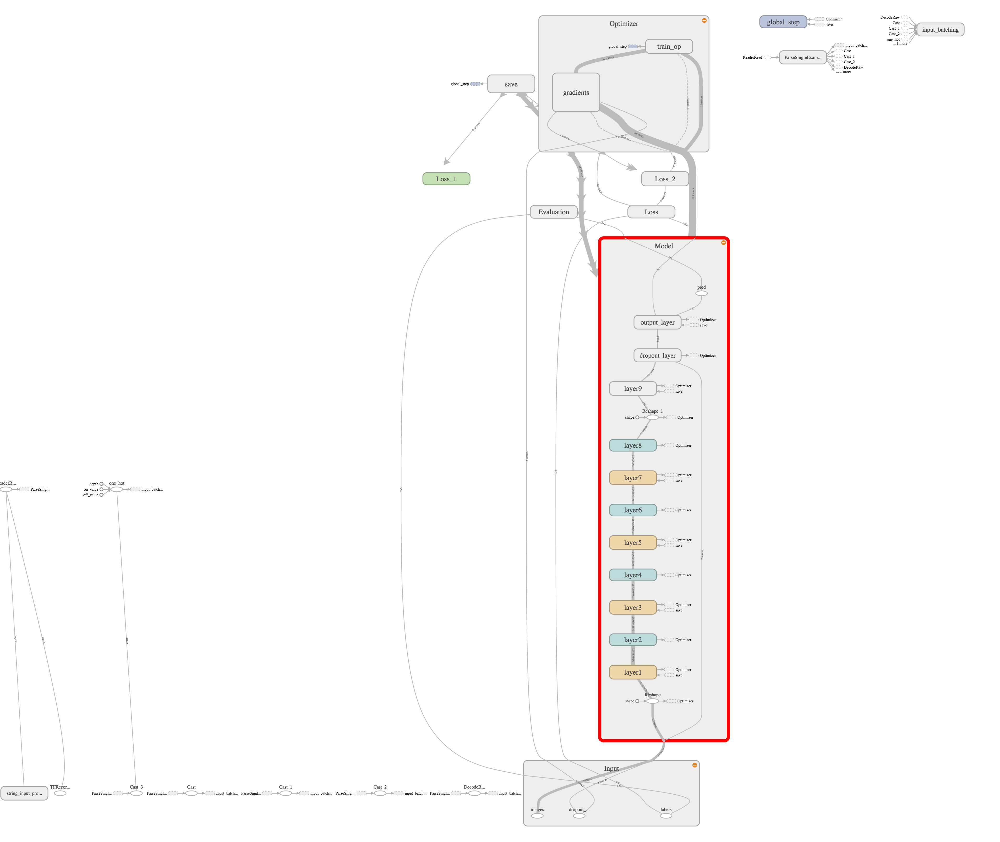
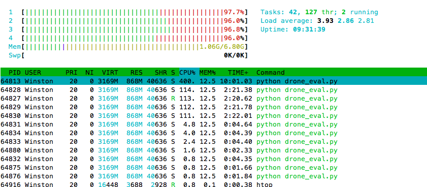
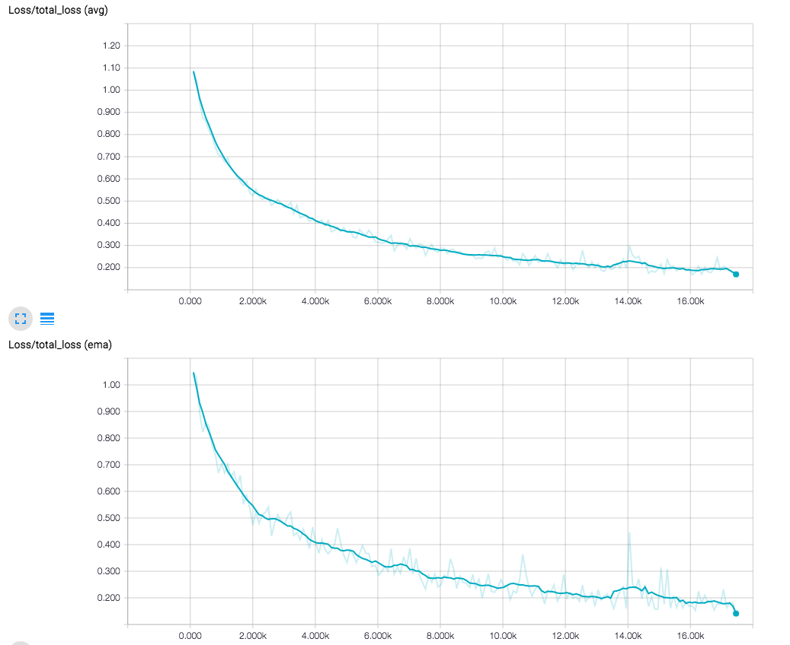

### Description
Based on mnist model/training/evaluation/predict skeleton, this subproject
exercises another model & dataset for drone autonomous flight via visual 
perception for mountain trails.

The model & dataset refer to http://people.idsia.ch/~guzzi/DataSet.html

The differences:
- no rescale input pixels to range[-1., 1.]
- use ReLU instead of hyperbolic tangent activation function 
- add dropout layer

The graph model visualized on TensorBoard as follows,


### Steps
- Training machines:

    (1) Training:
       
    Repeatly execute it for continuous training

    ```
    $ nohup python drone_train.py &
    ```
    (2) Evaluation:
    ```    
    $ python drone_eval.py
    ```
    (3) Finalize Model:
    ```
    $ python drone_freeze_model.py 

    ```

- Runtime devices:
    Copy the finalized model to devices.

    (4) Predict:
    ```
   $ python drone_predict.py 
    
    ```

### Notes
- Placeholders are used for images, labels, and keep_rate (dropout layer), so that
  it's easier to control the data feed/flow.
- Average loss and Expoential Moving Average loss across mini-batches are recorded instead of just the most
  recent mini-batch's loss.

### Experiments
- CPUs (Azure A3 Standard 4 Cores VM):
```
  ---Training---
  Grand New training
  2016-10-20 10:26:48.333485: step 10, train_loss = 1.103317 (24.5 examples/sec; 2.041 sec/batch)
  ...
  2016-10-20 11:48:34.709166: step 2910, train_loss = 0.440807 (30.4 examples/sec; 1.644 sec/batch)

  ---Evaluation---
  Restore from  /home/Winston/python/drone/models/model.ckpt-2912
  Accuracy (validation): 0.73333, elipsed time: 15.35872 sec for 1500 samples
  Accuracy (test): 0.56562, elipsed time: 340.61893 sec for 34000 samples
  Accuracy (train): 0.84165, elipsed time: 825.04505 sec for 72900 samples

  ---Training---
  Resume training after /home/Winston/python/drone/models/model.ckpt-2912
  accumulated step = 2912
  prevous avg_loss = 0.489
  2016-10-20 12:16:12.529820: step 10, train_loss = 0.504848 (29.4 examples/sec; 1.703 sec/batch)
  ...
  2016-10-20 13:42:14.774796: step 2910, train_loss = 0.244579 (26.7 examples/sec; 1.871 sec/batch)

  ---Evaluation---
  Restore from  /home/Winston/python/drone/models/model.ckpt-5824
  Accuracy (validation): 0.75000, elipsed time: 16.69647 sec for 1500 samples
  Accuracy (test): 0.57262, elipsed time: 372.10402 sec for 34000 samples
  Accuracy (train): 0.88602, elipsed time: 899.37906 sec for 72900 samples

  ---Training---
  Resume training after /home/Winston/python/drone/models/model.ckpt-5824
  accumulated step = 5824
  prevous avg_loss = 0.350
  2016-10-21 01:17:01.797935: step 10, train_loss = 0.220909 (30.1 examples/sec; 1.662 sec/batch)
  ...
  2016-10-21 02:38:56.182657: step 2910, train_loss = 0.140792 (31.1 examples/sec; 1.610 sec/batch)

  ---Evaluation---
  Restore from  /home/Winston/python/drone/models/model.ckpt-8736
  Accuracy (validataion): 0.76267, elipsed time: 15.07155 sec for 1500 samples
  Accuracy (test): 0.58197, elipsed time: 330.86784 sec for 34000 samples
  Accuracy (train): 0.91889, elipsed time: 710.20432 sec for 72900 samples

  ---Training---
  Resume training after /home/Winston/python/drone/models/model.ckpt-8736
  accumulated step = 8736
  prevous avg_loss = 0.261
  2016-10-21 03:06:34.334212: step 10, train_loss = 0.149017 (29.4 examples/sec; 1.701 sec/batch)
  ...
  2016-10-21 04:27:58.470688: step 2910, train_loss = 0.370483 (29.7 examples/sec; 1.682 sec/batch)

  ---Evaluation---
  Restore from  /home/Winston/python/drone/models/model.ckpt-11648
  Accuracy  (validataion): 0.66933, elipsed time: 15.31125 sec for 1500 samples
  Accuracy  (test): 0.63641, elipsed time: 330.27264 sec for 34000 samples
  Accuracy  (train): 0.92059, elipsed time: 707.47824 sec for 72900 samples

  ---Training---
  Resume training after /home/Winston/python/drone/models/model.ckpt-11648
  accumulated step = 11648
  prevous avg_loss = 0.225
  2016-10-21 05:01:45.003152: step 10, train_loss = 0.139914 (30.7 examples/sec; 1.627 sec/batch)
  ...
  2016-10-21 06:22:37.881518: step 2910, train_loss = 0.176219 (30.1 examples/sec; 1.659 sec/batch)

  ---Evaluation---
  Restore from  /home/Winston/python/drone/models/model.ckpt-14560
  Accuracy  (validataion): 0.76800, elipsed time: 15.10091 sec for 1500 samples
  Accuracy  (test): 0.52809, elipsed time: 327.62329 sec for 34000 samples
  Accuracy  (train): 0.94348, elipsed time: 706.66852 sec for 72900 samples

  ---Training---
  Resume training after /home/Winston/python/drone/models/model.ckpt-14560
  accumulated step = 14560
  prevous avg_loss = 0.224
  2016-10-21 06:55:10.957882: step 10, train_loss = 0.277702 (32.2 examples/sec; 1.553 sec/batch)
  ...
  2016-10-21 08:16:06.221006: step 2910, train_loss = 0.158320 (30.2 examples/sec; 1.656 sec/batch)

  ---Evaluation---
  Restore from  /home/Winston/python/drone/models/model.ckpt-17472
  Accuracy  (validataion): 0.74733, elipsed time: 15.24425 sec for 1500 samples
  Accuracy  (test): 0.57953, elipsed time: 328.94416 sec for 34000 samples
  Accuracy  (train): 0.96112, elipsed time: 713.80447 sec for 72900 samples

  ```
  The CPU utilization during training:
  

  The CPU utilization during evaluation:
  

  The training loss curve:
  

  The accuracy evaluation curve:
  
- GPU/GPUs (Azure NC6/NC12 VM):

